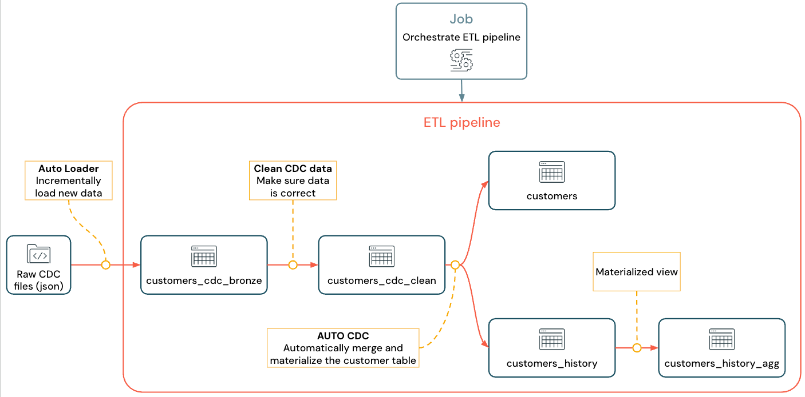

> **Note:** This document extends the official [_Build an ETL pipeline using change data capture_](https://learn.microsoft.com/en-us/azure/databricks/ldp/tutorial-pipelines)
> tutorial with additional explanations and further resources (see **🧩 Workshop add-on** sections).

Last updated: 2026-06-02.

---

# Tutorial: Build an ETL pipeline using change data capture

This tutorial shows how to build and deploy an ETL (extract, transform, load) pipeline with
**Lakeflow Spark Declarative Pipelines (SDP)**, **Auto Loader**, and **change data capture (CDC)**.
An ETL pipeline reads from source systems, transforms the data (quality checks, de-duplication,
and so on), and writes it to a target such as a lakehouse or a data warehouse.

Working from a `customers` table in a transactional database, you will:

- Land change events from a CDC tool into cloud object storage (S3, ADLS, or GCS) as JSON. To
  keep the tutorial self-contained, you generate fake CDC data instead of wiring up a real source.
- Use Auto Loader to incrementally ingest those messages into a raw bronze table, with schema
  inference and schema evolution handled for you.
- Apply expectations to produce a clean silver table. For example, `id` must never be null
  because it drives the upsert.
- Use `AUTO CDC ... INTO` to upsert the cleaned changes into a current-state `customers` table.
- Build a slowly changing dimension type 2 (SCD2) table that retains the full history of changes.

The goal is near real-time ingestion of raw data into analyst-ready tables, with data quality
enforced along the way. The pipeline follows the medallion architecture: raw data lands in
bronze, is cleaned and validated in silver, and is modeled and aggregated in gold. See
[What is the medallion lakehouse architecture?](https://learn.microsoft.com/en-us/azure/databricks/lakehouse/medallion).

> ### 🧩 Workshop add-on: learning objectives
> By the end of this tutorial you should be able to:
> - Ingest files incrementally with Auto Loader into a streaming bronze table.
> - Enforce data quality with expectations and choose the right violation mode.
> - Upsert change events into a current-state table with `AUTO CDC INTO`.
> - Explain when to use SCD Type 1 versus Type 2, and build both.
> - Schedule the pipeline as a Lakeflow Job for production.

The implemented flow looks like this:



For background, see [Lakeflow Spark Declarative Pipelines](https://learn.microsoft.com/en-us/azure/databricks/ldp/),
[What is Auto Loader?](https://learn.microsoft.com/en-us/azure/databricks/ingestion/cloud-object-storage/auto-loader/),
and [Change data capture and snapshots](https://learn.microsoft.com/en-us/azure/databricks/ldp/what-is-change-data-capture).

## Requirements

To complete this tutorial you must:

- Be logged into a Databricks Workspace with **Unity Catalog** enabled.
- Have [**serverless compute**](https://learn.microsoft.com/en-us/azure/databricks/compute/serverless/) available.
- Have permission to [create a compute resource](https://learn.microsoft.com/en-us/azure/databricks/compute/use-compute), or access to one.
- Have permission to [create a schema](https://learn.microsoft.com/en-us/azure/databricks/schemas/create-schema) in a catalog (`USE CATALOG` and `CREATE SCHEMA`).
- Have permission to [create a volume](https://learn.microsoft.com/en-us/azure/databricks/volumes/utility-commands) in an existing schema (`USE SCHEMA` and `CREATE VOLUME`).

## Change data capture in an ETL pipeline

Change data capture (CDC) captures row-level changes (inserts, updates, deletes) made in a
transactional database or warehouse, usually as a stream, so you can re-materialize those tables
elsewhere. It enables incremental loading and removes the need for repeated bulk reloads.

> Note: to keep the tutorial self-contained, you do not set up a real CDC system. Assume one is
> already running and writing CDC events as JSON files to cloud object storage. This tutorial uses
> the `Faker` library to generate that data.

### Capturing CDC

Many CDC tools exist. Debezium is a popular open-source option; managed alternatives include
Fivetran, Qlik Replicate, StreamSets, Talend, Oracle GoldenGate, and AWS DMS. A CDC tool captures
each changed row and typically streams the change history to Kafka topics or writes it to files.
Here you consume CDC output from such a system, validate it, and materialize the `customers` table
in the lakehouse.

### CDC input format

For each change you receive a JSON message with all fields of the affected row (`id`, `firstname`,
`lastname`, `email`, `address`), plus metadata:

- `operation`: the change type, one of `APPEND`, `UPDATE`, or `DELETE`.
- `operation_date`: the timestamp of the operation, used to order events.

Real tools can emit richer output (such as the row value before the change); this tutorial keeps
it simple.

## Step 1: Create a pipeline

Create a new ETL pipeline to read your CDC source and build the tables.

1. In the sidebar, click  **New**, then **ETL Pipeline**. The editor opens with a default name like `New Pipeline <date> <time>`.
2. Click the name and enter something descriptive, such as `Pipelines with CDC tutorial`.
3. Next to the name, click the catalog and schema to set defaults you can write to. These are used whenever your code does not specify a full path. Your code can still write anywhere by giving the full path.
4. *(Optional)* In the generated `my_transformation` file, pick **Python** or **SQL** from the language drop-down.
5. Click  **Use sample code**. The editor opens with sample files; you replace them with your own transformations in the next steps.

> ### 🧩 Workshop add-on: the `transformations/` folder *is* the pipeline
> Every new Lakeflow pipeline ships with a `transformations/` folder. **All `*.py` and
> `*.sql` files inside it are auto-discovered as pipeline source.** Lakeflow reads the
> dataset dependencies across those files and builds the DAG itself, so **file order and
> file count don't matter**, and a dataset in one file can reference a dataset defined in
> another. The `explorations/` folder used in Step 2 is the opposite: it is **not** run as
> part of a pipeline update, which is exactly why the one-off data generator lives there.
> Refs: [Lakeflow Pipelines Editor](https://docs.databricks.com/aws/en/ldp/multi-file-editor) and
> [Configure pipelines](https://docs.databricks.com/aws/en/ldp/configure-pipeline).

## Step 2: Create the sample data

Skip this step if you are ingesting your own source data. Otherwise, generate fake CDC data once.
Put the generator in the pipeline's `explorations` folder, which is **not** executed as part of a
pipeline update, so it runs only when you run it by hand.

> Note: this uses [Faker](https://pypi.org/project/Faker/) via `%pip install faker`. You can also
> declare faker as a notebook dependency instead.

1. In the asset browser, click  **Add**, then **Exploration**.
2. Give it a name such as `Setup data`, choose **Python**, and keep the default `explorations` destination.
3. Click **Create**.
4. Paste the following into the first cell, replacing `<my_catalog>` and `<my_schema>` with the defaults you chose in Step 1:

```python
%pip install faker
# Update these to match the catalog and schema
# that you used for the pipeline in step 1.
catalog = "<my_catalog>"
schema = dbName = db = "<my_schema>"

spark.sql(f'USE CATALOG `{catalog}`')
spark.sql(f'USE SCHEMA `{schema}`')
spark.sql(f'CREATE VOLUME IF NOT EXISTS `{catalog}`.`{db}`.`raw_data`')
volume_folder =  f"/Volumes/{catalog}/{db}/raw_data"

try:
  dbutils.fs.ls(volume_folder+"/customers")
except:
  print(f"folder doesn't exist, generating the data under {volume_folder}...")
  from pyspark.sql import functions as F
  from faker import Faker
  from collections import OrderedDict
  import uuid
  fake = Faker()
  import random

  fake_firstname = F.udf(fake.first_name)
  fake_lastname = F.udf(fake.last_name)
  fake_email = F.udf(fake.ascii_company_email)
  fake_date = F.udf(lambda:fake.date_time_this_month().strftime("%m-%d-%Y %H:%M:%S"))
  fake_address = F.udf(fake.address)
  operations = OrderedDict([("APPEND", 0.5),("DELETE", 0.1),("UPDATE", 0.3),(None, 0.01)])
  fake_operation = F.udf(lambda:fake.random_elements(elements=operations, length=1)[0])
  fake_id = F.udf(lambda: str(uuid.uuid4()) if random.uniform(0, 1) < 0.98 else None)

  df = spark.range(0, 100000).repartition(100)
  df = df.withColumn("id", fake_id())
  df = df.withColumn("firstname", fake_firstname())
  df = df.withColumn("lastname", fake_lastname())
  df = df.withColumn("email", fake_email())
  df = df.withColumn("address", fake_address())
  df = df.withColumn("operation", fake_operation())
  df_customers = df.withColumn("operation_date", fake_date())
  df_customers.repartition(100).write.format("json").mode("overwrite").save(volume_folder+"/customers")
```

5. Press **Shift** + **Enter** to run the cell and generate the dataset.
6. *(Optional)* Preview the data in the next cell (update the catalog and schema to match):

```python
# Update these to match the catalog and schema
# that you used for the pipeline in step 1.
catalog = "<my_catalog>"
schema = "<my_schema>"

display(spark.read.json(f"/Volumes/{catalog}/{schema}/raw_data/customers"))
```

This creates a large fake CDC dataset for the rest of the tutorial. Next, ingest it with Auto Loader.

## Step 3: Incrementally ingest data with Auto Loader (bronze)

The next step is to ingest the raw data from the (faked) cloud storage into a bronze layer.

This can be challenging for multiple reasons, as you must:

- Operate at scale, potentially ingesting millions of small files.
- Infer schema and JSON type.
- Handle bad records with incorrect JSON schema.
- Take care of schema evolution (for example, a new column in the customer table).

Auto Loader simplifies this ingestion, including schema inference and schema evolution, while scaling to millions of incoming files. Auto Loader is available in Python using `cloudFiles` and in SQL using the `SELECT * FROM STREAM read_files(...)` and can be used with a variety of formats (JSON, CSV, Apache Avro, etc.):

Defining the table as a streaming table guarantees that you only consume new incoming data. If you do not define it as a streaming table, it scans and ingests all the available data. See [Streaming tables](https://learn.microsoft.com/en-us/azure/databricks/ldp/streaming-tables) for more information.

1. To ingest the incoming CDC data using Auto Loader, copy and paste the following code into the code file that was created with your pipeline (called `my_transformation.py` or `my_transformation.sql`). You can use Python or SQL, based on the language you chose when creating the pipeline. Be sure to replace the `<catalog>` and `<schema>` with the ones that you set up for the default for the pipeline.

### Python

```python
from pyspark import pipelines as dp
from pyspark.sql.functions import *

# Replace with the catalog and schema name that
# you are using:
path = "/Volumes/<catalog>/<schema>/raw_data/customers"

# Create the target bronze table
dp.create_streaming_table("customers_cdc_bronze", comment="New customer data incrementally ingested from cloud object storage landing zone")

# Create an Append Flow to ingest the raw data into the bronze table
@dp.append_flow(
  target = "customers_cdc_bronze",
  name = "customers_bronze_ingest_flow"
)
def customers_bronze_ingest_flow():
  return (
      spark.readStream
          .format("cloudFiles")
          .option("cloudFiles.format", "json")
          .option("cloudFiles.inferColumnTypes", "true")
          .load(f"{path}")
  )
```

### SQL

```sql
CREATE OR REFRESH STREAMING TABLE customers_cdc_bronze
COMMENT "New customer data incrementally ingested from cloud object storage landing zone"
TBLPROPERTIES (
  "pipelines.reset.allowed" = "false"
);

CREATE FLOW customers_bronze_ingest_flow AS
INSERT INTO customers_cdc_bronze BY NAME
  SELECT *
  FROM STREAM read_files(
    -- replace with the catalog/schema you are using:
    "/Volumes/<catalog>/<schema>/raw_data/customers",
    format => "json",
    inferColumnTypes => "true"
  )
```

2. Click  **Run file** or **Run pipeline**. With only one source file, these are equivalent. When the run completes, the graph shows a single `customers_cdc_bronze` table, and the bottom panel shows its details.

### 🧩 Workshop add-on: Key Concepts
- Checkpoints are managed automatically
- Pipeline code inherits the default catalog and schema names. You can also write out to different catalogs and schemas using fully qualified names
- `pipelines.reset.allowed = false`: Prevents accidental full refresh ([when to full refresh](https://docs.databricks.com/aws/en/dlt/updates))
- Auto Loader, `_rescued_data`, and schema evolution: Auto Loader (`cloudFiles` in Python, `read_files` in SQL) remembers which files it has already processed, so reruns ingest only new files. Fields it cannot fit the inferred schema, or malformed records, are captured in the `_rescued_data` column instead of failing the load, and new source columns are picked up automatically. You filter on `_rescued_data IS NULL` in the next step to quarantine bad records.


## Step 4: Clean the data with expectations (silver)

Add a silver table that enforces data quality with expectations. Drop any row that fails: `id` is
null, an invalid `operation`, or JSON that Auto Loader could not parse (`_rescued_data IS NULL`).
See [Manage data quality with pipeline expectations](https://learn.microsoft.com/en-us/azure/databricks/ldp/expectations).

1. From the asset browser, click  **Add**, then **Transformation**.
2. Enter a name (for example, `customers_silver`) and choose Python or SQL. You can mix languages within one pipeline.
3. Paste the following into the new file:

### Python

```python
from pyspark import pipelines as dp
from pyspark.sql.functions import *

dp.create_streaming_table(
  name = "customers_cdc_clean",
  expect_all_or_drop = {"no_rescued_data": "_rescued_data IS NULL","valid_id": "id IS NOT NULL","valid_operation": "operation IN ('APPEND', 'DELETE', 'UPDATE')"}
  )

@dp.append_flow(
  target = "customers_cdc_clean",
  name = "customers_cdc_clean_flow"
)
def customers_cdc_clean_flow():
  return (
      spark.readStream.table("customers_cdc_bronze")
          .select("address", "email", "id", "firstname", "lastname", "operation", "operation_date", "_rescued_data")
  )
```

### SQL

```sql
CREATE OR REFRESH STREAMING TABLE customers_cdc_clean (
  CONSTRAINT no_rescued_data EXPECT (_rescued_data IS NULL) ON VIOLATION DROP ROW,
  CONSTRAINT valid_id EXPECT (id IS NOT NULL) ON VIOLATION DROP ROW,
  CONSTRAINT valid_operation EXPECT (operation IN ('APPEND', 'DELETE', 'UPDATE')) ON VIOLATION DROP ROW
)
COMMENT "New customer data incrementally ingested from cloud object storage landing zone";

CREATE FLOW customers_cdc_clean_flow AS
INSERT INTO customers_cdc_clean BY NAME
SELECT * FROM STREAM customers_cdc_bronze;
```

4. Click  **Run file** or **Run pipeline**. With two source files these now differ: **Run pipeline** runs everything (and would pull new input into bronze), while **Run file** runs only this file, generating silver from the cached bronze table for faster iteration. The graph now shows two tables, silver depending on bronze.

> ### 🧩 Workshop add-on: the three expectation violation modes
> This step uses `DROP ROW`, but expectations support three behaviours. Pick by how serious the
> rule is:
>
> | Mode | Bad rows | The run | Use when |
> |---|---|---|---|
> | `ON VIOLATION FAIL UPDATE` | Not written | Fails immediately | The rule is a hard invariant, for example a primary key that must not be null. |
> | `ON VIOLATION DROP ROW` | Dropped from the target | Continues | You want clean output and can safely discard bad records (the silver checks above). |
> | *(no `ON VIOLATION`)*, the default | Kept in the target | Continues | You only want to measure data health. Violations are recorded as metrics or warnings and the data is unchanged. |
>
> SQL uses the `ON VIOLATION ...` clause; Python uses `expect_all_or_fail`, `expect_all_or_drop`,
> and `expect_all` (and their single-rule `expect_or_*` variants).

## Step 5: Materialize the customers table with an AUTO CDC flow (current state)

So far the tables have just passed the CDC events along. Now build a `customers` table that holds
the current state of each customer, a replica of the source rather than the log of operations that
produced it. Doing this by hand means deduplicating to keep the most recent row per key. `AUTO CDC`
does it for you.

1. From the asset browser, click  **Add**, then **Transformation**.
2. Enter a name and choose Python or SQL.
3. Paste the following into the new file:

### Python

```python
from pyspark import pipelines as dp
from pyspark.sql.functions import *

dp.create_streaming_table(name="customers", comment="Clean, materialized customers")

dp.create_auto_cdc_flow(
  target="customers",  # The customer table being materialized
  source="customers_cdc_clean",  # the incoming CDC
  keys=["id"],  # what we'll be using to match the rows to upsert
  sequence_by=col("operation_date"),  # de-duplicate by operation date, getting the most recent value
  ignore_null_updates=False,
  apply_as_deletes=expr("operation = 'DELETE'"),  # DELETE condition
  except_column_list=["operation", "operation_date", "_rescued_data"],
)
```

### SQL

```sql
CREATE OR REFRESH STREAMING TABLE customers;

CREATE FLOW customers_cdc_flow
AS AUTO CDC INTO customers
FROM stream(customers_cdc_clean)
KEYS (id)
APPLY AS DELETE WHEN
operation = "DELETE"
SEQUENCE BY operation_date
COLUMNS * EXCEPT (operation, operation_date, _rescued_data)
STORED AS SCD TYPE 1;
```

4. Click  **Run file**. The graph now shows three tables, bronze to silver to gold.

> ### 🧩 Workshop add-on: AUTO CDC, clause by clause
> | SQL clause | Python argument | What it does |
> |---|---|---|
> | `KEYS (id)` | `keys=["id"]` | The key columns used to match an incoming change to an existing row for the upsert. |
> | `SEQUENCE BY operation_date` | `sequence_by=col("operation_date")` | Orders events so the latest change wins, and resolves out-of-order arrivals. |
> | `APPLY AS DELETE WHEN operation = "DELETE"` | `apply_as_deletes=expr("operation = 'DELETE'")` | Treats matching rows as deletes instead of upserts. |
> | `COLUMNS * EXCEPT (...)` | `except_column_list=[...]` | Which source columns to write to the target. Here it drops the CDC metadata columns. |
> | `STORED AS SCD TYPE 1` | `stored_as_scd_type` (default 1) | Keeps current state only (Type 1). Use `2` for full history (Step 6). |
> | *(no SQL form shown)* | `ignore_null_updates=False` | When false, null fields in an update overwrite existing values; when true, nulls are ignored. |

## Step 6: Track update history with SCD Type 2

It is often necessary to keep a table that records every `APPEND`, `UPDATE`, and `DELETE` over
time, both for history (what the data used to be) and traceability (which operation happened).
Building this by hand is hard, especially with out-of-order events. Lakeflow SDP maintains an SCD2
table for you and resolves out-of-order records using the sequencing column. Switch to SCD2 with
`STORED AS SCD TYPE 2` (SQL) or `stored_as_scd_type="2"` (Python).

> Note: you can limit which columns are tracked with
> `TRACK HISTORY ON {columnList | EXCEPT(exceptColumnList)}`.

1. From the asset browser, click  **Add**, then **Transformation**.
2. Enter a name and choose Python or SQL.
3. Paste the following into the new file:

#### Python

```python
from pyspark import pipelines as dp
from pyspark.sql.functions import *

# create the table
dp.create_streaming_table(
    name="customers_history", comment="Slowly Changing Dimension Type 2 for customers"
)

# store all changes as SCD2
dp.create_auto_cdc_flow(
    target="customers_history",
    source="customers_cdc_clean",
    keys=["id"],
    sequence_by=col("operation_date"),
    ignore_null_updates=False,
    apply_as_deletes=expr("operation = 'DELETE'"),
    except_column_list=["operation", "operation_date", "_rescued_data"],
    stored_as_scd_type="2",
)  # Enable SCD2 and store individual updates
```

#### SQL

```sql
CREATE OR REFRESH STREAMING TABLE customers_history;

CREATE FLOW customers_history_cdc
AS AUTO CDC INTO
  customers_history
FROM stream(customers_cdc_clean)
KEYS (id)
APPLY AS DELETE WHEN
operation = "DELETE"
SEQUENCE BY operation_date
COLUMNS * EXCEPT (operation, operation_date, _rescued_data)
STORED AS SCD TYPE 2;
```

4. Click  **Run file**. The graph now includes `customers_history`, also depending on the silver table, for four tables total.

> ### 🧩 Workshop add-on: SCD Type 1 vs Type 2
> Both flows above read the same clean CDC stream; the only difference is `STORED AS SCD TYPE 1`
> versus `TYPE 2`. Choose by what the consumer needs:
>
> | Use Type 1 (the `customers` table) when | Use Type 2 (the `customers_history` table) when |
> |---|---|
> | You only need the current value of each record. | You need an audit trail of every change over time. |
> | Simpler, smaller storage and queries matter most. | You must answer "what did this record look like at time T". |
> | Downstream consumers always want the latest state. | Compliance, fraud detection, or trend analysis needs history. |
>
> **Worked example:** a customer changes their email. Type 1 overwrites the row in `customers`, so
> the old email is gone. Type 2 keeps both the old and new rows in `customers_history` with
> validity ranges, so you can see exactly when the change happened.

## Step 7: Aggregate history in a materialized view (gold)

`customers_history` holds every historical change. Build a materialized view that counts how many
distinct values each customer has had per field, a proxy for who changes their information most
(useful for fraud detection or recommendations). Because SCD2 already removed duplicates, you can
count rows per `id` directly.

1. From the asset browser, click  **Add**, then **Transformation**.
2. Enter a name and choose Python or SQL.
3. Paste the following into the new file:

### Python

```python
from pyspark import pipelines as dp
from pyspark.sql.functions import *

@dp.table(
  name = "customers_history_agg",
  comment = "Aggregated customer history"
)
def customers_history_agg():
  return (
    spark.read.table("customers_history")
      .groupBy("id")
      .agg(
          count_distinct("address").alias("address_count"),
          count_distinct("email").alias("email_count"),
          count_distinct("firstname").alias("firstname_count"),
          count_distinct("lastname").alias("lastname_count")
      )
  )
```

### SQL

```sql
CREATE OR REPLACE MATERIALIZED VIEW customers_history_agg AS
SELECT
  id,
  count(distinct address) as address_count,
  count(distinct email) AS email_count,
  count(distinct firstname) AS firstname_count,
  count(distinct lastname) AS lastname_count
FROM customers_history
GROUP BY id
```

4. Click  **Run file**. A new table appears in the graph, depending on `customers_history`. The pipeline is now complete; you can run the whole thing with **Run pipeline** to confirm.

> ### 🧩 Workshop add-on: see incremental processing for yourself
> Re-run the **Setup data** notebook to drop a fresh batch of CDC events into the `raw_data` volume,
> then click **Run pipeline** again. Auto Loader ingests only the new files into
> `customers_cdc_bronze`, `AUTO CDC` upserts the changes into `customers`, and `customers_history`
> gains new versioned rows. This demonstrates incremental processing rather than just describing it.

## Step 8: Schedule the pipeline as a job

Automate ingestion, processing, and analysis by running the pipeline on a schedule with a Lakeflow Job.

1. At the top of the editor, click **Schedule**.
2. If the **Schedules** dialog appears, click **Add schedule**.
3. In **New schedule**, optionally name the job.
4. The default runs once per day. Accept it or set your own. **Advanced** sets a specific run time; **More options** adds run notifications.
5. Click **Create**.

The job now runs daily. Click **Schedule** again to view or manage schedules, or open the job from
the **Jobs & pipelines** list to see run history or trigger **Run now**. See
[Monitoring and observability for Lakeflow Jobs](https://learn.microsoft.com/en-us/azure/databricks/jobs/monitor).

> ### 🧩 Workshop add-on: triggered vs continuous execution
> Scheduling answers *when* the pipeline runs; execution mode answers *how* it runs while updating:
>
> | | **Triggered** | **Continuous** |
> |---|---|---|
> | Behaviour | Runs to completion, then stops | Keeps running, processes data as it arrives |
> | Latency | Batch (minutes to hours) | Low (seconds) |
> | Cost | Pay per run | Always-on compute |
> | Default and good for | Most ETL and scheduled refreshes (this tutorial) | Real-time or low-latency needs |
>
> Start with **Triggered** unless you have a real latency requirement. For choosing between streaming tables, materialized views, and views see [batch vs streaming recommendations](https://docs.databricks.com/aws/en/data-engineering/batch-vs-streaming#recommendations).

> ### 🧩 Workshop add-on: guard against accidental full refreshes
> A **full refresh** drops a streaming table's state and re-ingests everything from source, which is
> expensive and destructive for append-only history such as `customers_history`. You can block it
> per table:
> ```sql
> TBLPROPERTIES ("pipelines.reset.allowed" = false)
> ```
> Add this to streaming tables you never want rebuilt by an over-eager click. See
> [when to full-refresh](https://docs.databricks.com/aws/en/ldp/updates).

> ### 🧩 Workshop add-on: tighten your inner loop
> While developing, you do not have to rebuild the whole DAG every time:
> - **Run file** runs only the current source file against cached upstream tables. Use it for fast
>   iteration on one transformation (the tutorial uses this from Step 4 onward).
> - **Run pipeline** runs the entire DAG and pulls in any new source data.
> - **Dry run** validates syntax and the dependency graph **without** writing any data, so you catch
>   typos and broken references in seconds.

> ### 🧩 Workshop add-on: key takeaways
> - A Lakeflow pipeline is **declarative**: you describe datasets, and Lakeflow builds and orders
>   the DAG from the files in `transformations/`.
> - **Auto Loader** plus a **streaming table** gives incremental, schema-evolving ingestion; bad
>   records land in `_rescued_data`.
> - **Expectations** are your data-quality contract. Choose `FAIL UPDATE`, `DROP ROW`, or the
>   default deliberately.
> - **AUTO CDC INTO** handles deduplication, deletes, and ordering; `SCD TYPE 1` keeps current
>   state, `SCD TYPE 2` keeps full history from the same source.
> - Production pipelines are scheduled as **Lakeflow Jobs**; protect history tables with
>   `pipelines.reset.allowed = false`.

## Where to go next

> ### 🧩 Workshop add-on: curated next steps and references
> | Topic | Link |
> |---|---|
> | All Lakeflow tutorials (parent page) | https://learn.microsoft.com/en-us/azure/databricks/ldp/tutorials |
> | Change data capture and snapshots | https://learn.microsoft.com/en-us/azure/databricks/ldp/what-is-change-data-capture |
> | Manage data quality with expectations | https://learn.microsoft.com/en-us/azure/databricks/ldp/expectations |
> | When to (and not to) full-refresh | https://docs.databricks.com/aws/en/ldp/updates |
> | Batch vs streaming decision rubric | https://docs.databricks.com/aws/en/data-engineering/batch-vs-streaming#recommendations |
> | Where is DLT? (rename and soft-deprecation) | https://docs.databricks.com/aws/en/ldp/where-is-dlt |
 | `pyspark.pipelines` Python dev guide | https://docs.databricks.com/aws/en/ldp/developer/python-dev |
> | Tutorial: create a source-controlled pipeline (_strongly recommend doing next_) | https://learn.microsoft.com/en-us/azure/databricks/ldp/source-controlled |
> | Tutorial: convert a pipeline to a bundle (_strongly recommend doing #2 after source-controlled one_)| https://learn.microsoft.com/en-us/azure/databricks/ldp/convert-to-dab |
